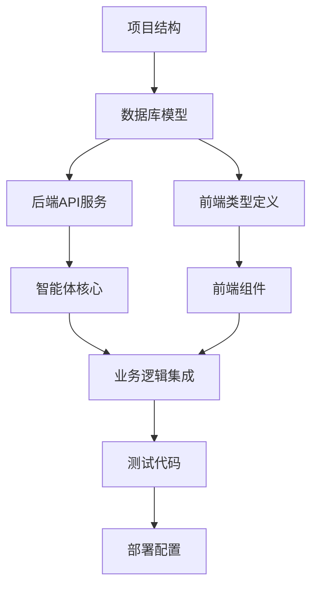

# AI代码生成器实施指南

> **目标**: 为大模型驱动的Code Agent提供精确的代码生成指导
> **适用**: LangChain Agent、GPT-4 Code Interpreter、Claude等AI代码生成器

## 🎯 生成策略

### 代码生成优先级顺序
```
1. 项目结构创建 → 2. 数据库设计 → 3. 后端核心服务 → 4. 前端基础组件 → 5. 业务逻辑实现 → 6. 集成测试 → 7. 部署配置
```

### 模块生成依赖关系


## 📋 代码生成检查清单

### Phase 1: 基础架构 (必须先完成)
- [ ] 创建完整的项目目录结构
- [ ] 配置文件模板 (package.json, requirements.txt, docker-compose.yml)
- [ ] 环境变量配置文件 (.env.example)
- [ ] 数据库连接配置
- [ ] 基础依赖安装脚本

### Phase 2: 数据层 (依赖Phase 1)
- [ ] SQLAlchemy数据模型 (User, Strategy, Conversation, ETF, News)
- [ ] Pydantic数据模式 (schemas)
- [ ] 数据库迁移脚本 (Alembic)
- [ ] Redis缓存配置
- [ ] 数据访问层 (Repository Pattern)

### Phase 3: 后端服务 (依赖Phase 2)
- [ ] FastAPI应用入口 (main.py)
- [ ] 认证服务 (JWT + 密码哈希)
- [ ] API路由 (auth, conversation, strategy, websocket)
- [ ] 中间件 (CORS, 异常处理, 日志)
- [ ] WebSocket连接管理器

### Phase 4: 智能体系统 (依赖Phase 3)
- [ ] LangChain工具基类
- [ ] 具体工具实现 (用户识别、要素提取、策略生成等)
- [ ] LangGraph工作流定义
- [ ] 智能体核心逻辑
- [ ] 内容安全审查系统

### Phase 5: 前端基础 (依赖Phase 2类型定义)
- [ ] TypeScript类型定义
- [ ] Redux状态管理配置
- [ ] 基础UI组件 (Button, Input, Card, Modal)
- [ ] 自研图表组件 (PieChart, LineChart)
- [ ] CSS样式系统 (变量, 主题)

### Phase 6: 前端业务组件 (依赖Phase 5)
- [ ] 用户认证页面 (Login, Register)
- [ ] 对话交互组件 (ConversationPanel)
- [ ] 策略展示组件 (StrategyDisplay)
- [ ] 历史管理组件 (StrategyHistory)
- [ ] WebSocket通信Hook

### Phase 7: 集成与测试 (依赖前面所有)
- [ ] API集成测试
- [ ] 前端组件测试
- [ ] 端到端测试
- [ ] 性能测试
- [ ] 安全测试

### Phase 8: 部署配置 (最后完成)
- [ ] Docker镜像配置
- [ ] Nginx配置
- [ ] 启动脚本
- [ ] 监控配置
- [ ] 文档生成

## 🛠️ 代码生成规范

### 文件命名规范
```
后端文件:
- 模型: {entity}.py (如: user.py, strategy.py)
- 服务: {entity}_service.py (如: auth_service.py)
- API: {entity}.py (如: auth.py, conversation.py)
- 工具: {tool_name}.py (如: user_identification.py)

前端文件:
- 组件: {ComponentName}/index.tsx + {ComponentName}.module.css
- 页面: {PageName}Page.tsx
- Hook: use{HookName}.ts
- 类型: {entity}.ts
- 服务: {service}.ts
```

### 代码质量标准
```python
# 后端代码标准示例
from typing import Optional, List, Dict, Any
from pydantic import BaseModel, Field
from sqlalchemy.orm import Session
import logging

logger = logging.getLogger(__name__)

class UserService:
    """用户服务类
    
    提供用户相关的业务逻辑处理
    """
    
    def __init__(self, db: Session):
        self.db = db
    
    async def create_user(
        self, 
        user_data: UserCreateSchema
    ) -> Optional[UserResponseSchema]:
        """创建新用户
        
        Args:
            user_data: 用户创建数据
            
        Returns:
            创建成功的用户信息，失败返回None
            
        Raises:
            ValueError: 当用户数据无效时
            DatabaseError: 当数据库操作失败时
        """
        try:
            # 实现逻辑
            logger.info(f"Creating user with phone: {user_data.phone_number}")
            # ...
            return user_response
        except Exception as e:
            logger.error(f"Failed to create user: {str(e)}")
            raise
```

```typescript
// 前端代码标准示例
import React, { useState, useEffect, useCallback } from 'react';
import { useDispatch, useSelector } from 'react-redux';
import type { RootState } from '../store';
import type { User, ApiResponse } from '../types';
import styles from './UserProfile.module.css';

interface UserProfileProps {
  userId: number;
  onUpdate?: (user: User) => void;
}

/**
 * 用户资料组件
 * 
 * @param userId - 用户ID
 * @param onUpdate - 更新回调函数
 */
const UserProfile: React.FC<UserProfileProps> = ({ 
  userId, 
  onUpdate 
}) => {
  const [loading, setLoading] = useState(false);
  const [error, setError] = useState<string | null>(null);
  
  const dispatch = useDispatch();
  const user = useSelector((state: RootState) => state.auth.user);

  const handleUpdate = useCallback(async (userData: Partial<User>) => {
    setLoading(true);
    setError(null);
    
    try {
      // 实现逻辑
      console.log('Updating user:', userData);
      // ...
      onUpdate?.(updatedUser);
    } catch (err) {
      setError(err instanceof Error ? err.message : '更新失败');
    } finally {
      setLoading(false);
    }
  }, [onUpdate]);

  // JSX实现
  return (
    <div className={styles.userProfile}>
      {/* 组件内容 */}
    </div>
  );
};

export default UserProfile;
```

### 错误处理规范
```python
# 后端错误处理
from fastapi import HTTPException, status
from app.core.exceptions import BusinessException, ValidationException

@router.post("/users")
async def create_user(user_data: UserCreate):
    try:
        result = await user_service.create_user(user_data)
        return {"success": True, "data": result}
    except ValidationException as e:
        raise HTTPException(
            status_code=status.HTTP_400_BAD_REQUEST,
            detail={"error": "validation_error", "message": str(e)}
        )
    except BusinessException as e:
        raise HTTPException(
            status_code=status.HTTP_409_CONFLICT,
            detail={"error": "business_error", "message": str(e)}
        )
    except Exception as e:
        logger.error(f"Unexpected error: {str(e)}")
        raise HTTPException(
            status_code=status.HTTP_500_INTERNAL_SERVER_ERROR,
            detail={"error": "internal_error", "message": "服务器内部错误"}
        )
```

```typescript
// 前端错误处理
import { createAsyncThunk } from '@reduxjs/toolkit';
import { ApiError } from '../types/api';

export const loginUser = createAsyncThunk(
  'auth/login',
  async (credentials: LoginCredentials, { rejectWithValue }) => {
    try {
      const response = await api.post('/auth/login', credentials);
      return response.data;
    } catch (error) {
      if (error instanceof ApiError) {
        return rejectWithValue({
          message: error.message,
          code: error.code,
          details: error.details
        });
      }
      return rejectWithValue({
        message: '登录失败，请稍后重试',
        code: 'UNKNOWN_ERROR'
      });
    }
  }
);
```

## 📝 具体实现模板

### 1. 数据模型模板
```python
# app/models/base.py
from sqlalchemy import Column, Integer, DateTime
from sqlalchemy.ext.declarative import declarative_base
from sqlalchemy.sql import func

Base = declarative_base()

class TimestampMixin:
    """时间戳混入类"""
    created_at = Column(DateTime(timezone=True), server_default=func.now())
    updated_at = Column(DateTime(timezone=True), onupdate=func.now())

class BaseModel(Base, TimestampMixin):
    """基础模型类"""
    __abstract__ = True
    
    id = Column(Integer, primary_key=True, index=True)
```

### 2. API路由模板
```python
# app/api/{entity}.py
from fastapi import APIRouter, Depends, HTTPException, status
from sqlalchemy.orm import Session
from typing import List

from app.core.database import get_db
from app.core.security import get_current_user
from app.models.user import User
from app.schemas.{entity} import {Entity}Create, {Entity}Response, {Entity}Update
from app.services.{entity}_service import {Entity}Service

router = APIRouter(prefix="/{entities}", tags=["{entities}"])

@router.get("/", response_model=List[{Entity}Response])
async def get_{entities}(
    skip: int = 0,
    limit: int = 100,
    db: Session = Depends(get_db),
    current_user: User = Depends(get_current_user)
):
    """获取{实体}列表"""
    service = {Entity}Service(db)
    return await service.get_{entities}(skip=skip, limit=limit, user_id=current_user.id)

@router.post("/", response_model={Entity}Response)
async def create_{entity}(
    {entity}_data: {Entity}Create,
    db: Session = Depends(get_db),
    current_user: User = Depends(get_current_user)
):
    """创建{实体}"""
    service = {Entity}Service(db)
    return await service.create_{entity}({entity}_data, user_id=current_user.id)
```

### 3. 前端组件模板
```typescript
// src/components/{ComponentName}/index.tsx
import React, { useState, useEffect } from 'react';
import { useDispatch, useSelector } from 'react-redux';
import type { RootState } from '../../store';
import styles from './{ComponentName}.module.css';

interface {ComponentName}Props {
  // 定义组件属性
}

const {ComponentName}: React.FC<{ComponentName}Props> = (props) => {
  // 状态定义
  const [loading, setLoading] = useState(false);
  const [error, setError] = useState<string | null>(null);
  
  // Redux状态
  const dispatch = useDispatch();
  const data = useSelector((state: RootState) => state.{slice}.data);
  
  // 副作用
  useEffect(() => {
    // 组件挂载时的逻辑
  }, []);
  
  // 事件处理函数
  const handleAction = async () => {
    setLoading(true);
    try {
      // 处理逻辑
    } catch (err) {
      setError(err instanceof Error ? err.message : '操作失败');
    } finally {
      setLoading(false);
    }
  };
  
  return (
    <div className={styles.{componentName}}>
      {/* 组件内容 */}
    </div>
  );
};

export default {ComponentName};
```

### 4. CSS模块模板
```css
/* src/components/{ComponentName}/{ComponentName}.module.css */
.{componentName} {
  /* 使用CSS变量 */
  background: var(--background-color);
  border-radius: var(--border-radius-large);
  padding: var(--spacing-lg);
  box-shadow: var(--shadow-light);
  transition: all var(--transition-base);
}

.{componentName}:hover {
  box-shadow: var(--shadow-medium);
  transform: translateY(-2px);
}

.loading {
  opacity: 0.6;
  pointer-events: none;
}

.error {
  color: var(--error-color);
  font-size: var(--font-size-sm);
  margin-top: var(--spacing-xs);
}

/* 响应式设计 */
@media (max-width: 768px) {
  .{componentName} {
    padding: var(--spacing-md);
  }
}
```

## 🔧 工具和配置模板

### package.json模板
```json
{
  "name": "etf-strategy-frontend",
  "version": "1.0.0",
  "type": "module",
  "scripts": {
    "dev": "vite",
    "build": "tsc && vite build",
    "preview": "vite preview",
    "test": "jest",
    "test:watch": "jest --watch",
    "lint": "eslint src --ext ts,tsx --report-unused-disable-directives --max-warnings 0",
    "lint:fix": "eslint src --ext ts,tsx --fix"
  },
  "dependencies": {
    "react": "^18.2.0",
    "react-dom": "^18.2.0",
    "react-router-dom": "^6.10.0",
    "@reduxjs/toolkit": "^1.9.5",
    "react-redux": "^8.0.5",
    "axios": "^1.4.0"
  },
  "devDependencies": {
    "@types/react": "^18.0.37",
    "@types/react-dom": "^18.0.11",
    "@typescript-eslint/eslint-plugin": "^5.59.0",
    "@typescript-eslint/parser": "^5.59.0",
    "@vitejs/plugin-react": "^4.0.0",
    "eslint": "^8.38.0",
    "eslint-plugin-react-hooks": "^4.6.0",
    "eslint-plugin-react-refresh": "^0.3.4",
    "typescript": "^5.0.2",
    "vite": "^4.3.9",
    "jest": "^29.5.0",
    "@testing-library/react": "^14.0.0",
    "@testing-library/jest-dom": "^5.16.5"
  }
}
```

### requirements.txt模板
```txt
# Web框架
fastapi==0.100.0
uvicorn[standard]==0.22.0

# 数据库
sqlalchemy==2.0.15
alembic==1.11.1
pymysql==1.0.3
redis==4.5.5

# AI框架
langchain==0.1.0
langgraph==0.0.30

# 数据处理
pandas==2.0.2
numpy==1.24.3
pyodbc==4.0.39
httpx==0.24.1

# 异步任务
celery==5.3.0

# 安全
python-jose[cryptography]==3.3.0
passlib[bcrypt]==1.7.4
python-multipart==0.0.6

# 验证
pydantic==2.0.2
email-validator==2.0.0

# 工具
python-dotenv==1.0.0
pyyaml==6.0

# 开发工具
pytest==7.3.1
pytest-asyncio==0.21.0
black==23.3.0
isort==5.12.0
mypy==1.3.0
```

### tsconfig.json模板
```json
{
  "compilerOptions": {
    "target": "ES2020",
    "useDefineForClassFields": true,
    "lib": ["ES2020", "DOM", "DOM.Iterable"],
    "module": "ESNext",
    "skipLibCheck": true,
    "moduleResolution": "bundler",
    "allowImportingTsExtensions": true,
    "resolveJsonModule": true,
    "isolatedModules": true,
    "noEmit": true,
    "jsx": "react-jsx",
    "strict": true,
    "noUnusedLocals": true,
    "noUnusedParameters": true,
    "noFallthroughCasesInSwitch": true,
    "baseUrl": ".",
    "paths": {
      "@/*": ["src/*"],
      "@/components/*": ["src/components/*"],
      "@/pages/*": ["src/pages/*"],
      "@/hooks/*": ["src/hooks/*"],
      "@/services/*": ["src/services/*"],
      "@/store/*": ["src/store/*"],
      "@/types/*": ["src/types/*"],
      "@/utils/*": ["src/utils/*"]
    }
  },
  "include": ["src"],
  "references": [{ "path": "./tsconfig.node.json" }]
}
```

## 🚀 代码生成执行流程

### Step 1: 环境准备
```bash
# 创建项目结构
mkdir etf-strategy-system
cd etf-strategy-system
mkdir -p frontend/{src/{components,pages,hooks,services,store,types,utils,styles},public}
mkdir -p backend/{app/{api,core,models,schemas,services,agent,tools,safety,data,cache,tasks,utils},config,tests,data}

# 初始化前端
cd frontend
npm init -y
# 安装依赖...

# 初始化后端
cd ../backend
python -m venv venv
source venv/bin/activate  # Windows: venv\Scripts\activate
pip install -r requirements.txt
```

### Step 2: 数据库设置
```python
# 生成数据库迁移
alembic init alembic
alembic revision --autogenerate -m "Initial migration"
alembic upgrade head
```

### Step 3: 开发服务启动
```bash
# 后端开发服务
cd backend
uvicorn main:app --reload --host 0.0.0.0 --port 8000

# 前端开发服务
cd frontend
npm run dev

# Redis和MySQL (使用Docker)
docker-compose up -d mysql redis
```

### Step 4: 代码生成验证
```bash
# 运行测试
cd backend
pytest tests/

cd ../frontend
npm test

# 类型检查
cd backend
mypy app/

cd ../frontend
npm run type-check
```

## 📊 质量保证规范

### 代码审查检查点
- [ ] **类型安全**: 所有函数都有类型注解
- [ ] **错误处理**: 完善的异常处理机制
- [ ] **日志记录**: 关键操作都有日志
- [ ] **安全检查**: 输入验证和权限控制
- [ ] **性能考虑**: 数据库查询优化、缓存使用
- [ ] **测试覆盖**: 核心逻辑有单元测试
- [ ] **文档完整**: 函数和类有详细文档
- [ ] **代码规范**: 符合PEP8和ESLint规范

### 测试策略
```python
# 后端测试示例
import pytest
from fastapi.testclient import TestClient
from app.main import app

client = TestClient(app)

def test_user_registration():
    response = client.post("/auth/register", json={
        "phone_number": "13800138000",
        "password": "test123456",
        "nickname": "测试用户"
    })
    assert response.status_code == 200
    assert "access_token" in response.json()

@pytest.mark.asyncio
async def test_strategy_generation():
    # 测试策略生成逻辑
    pass
```

```typescript
// 前端测试示例
import { render, screen, fireEvent } from '@testing-library/react';
import { Provider } from 'react-redux';
import { store } from '../store';
import LoginForm from '../components/auth/LoginForm';

test('renders login form', () => {
  render(
    <Provider store={store}>
      <LoginForm />
    </Provider>
  );
  
  expect(screen.getByPlaceholderText('请输入手机号')).toBeInTheDocument();
  expect(screen.getByPlaceholderText('请输入密码')).toBeInTheDocument();
});

test('handles form submission', async () => {
  const mockOnSuccess = jest.fn();
  
  render(
    <Provider store={store}>
      <LoginForm onSuccess={mockOnSuccess} />
    </Provider>
  );
  
  fireEvent.change(screen.getByPlaceholderText('请输入手机号'), {
    target: { value: '13800138000' }
  });
  
  fireEvent.change(screen.getByPlaceholderText('请输入密码'), {
    target: { value: 'test123456' }
  });
  
  fireEvent.click(screen.getByText('登录'));
  
  // 验证提交逻辑
});
```

## 🎯 最终交付清单

### 代码交付物
- [ ] 完整的前后端源代码
- [ ] 数据库迁移脚本
- [ ] Docker配置文件
- [ ] 环境配置模板
- [ ] 启动脚本

### 文档交付物
- [ ] API文档 (自动生成)
- [ ] 组件文档
- [ ] 部署文档
- [ ] 开发文档
- [ ] 用户手册

### 测试交付物
- [ ] 单元测试代码
- [ ] 集成测试代码
- [ ] 测试报告
- [ ] 性能测试报告
- [ ] 安全测试报告

---

**重要提醒**: 
1. 严格按照此指南顺序生成代码
2. 每个模块完成后进行测试验证
3. 确保代码质量达到生产标准
4. 所有配置和密钥使用环境变量
5. 生成的代码必须可以直接运行
