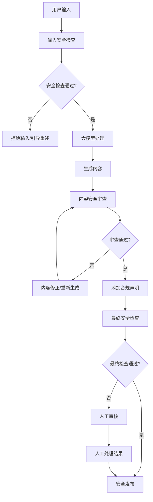

# ETF资产配置策略系统 - 大模型内容安全审查方案

## 🎯 审查目标

确保大模型生成的所有内容符合法律法规要求，维护系统的合规性和安全性，保障用户体验的同时防范内容风险。

## 🚫 审查标准

### 禁止内容类型

#### 1. NSFW内容
- 色情、暴力、血腥等不适宜内容
- 涉及成人内容的描述或建议
- 不适合工作场所展示的内容

#### 2. 政治敏感内容
- 政治立场倾向性言论
- 敏感政治话题和事件评论
- 政府政策的主观评价
- 政治人物的个人观点

#### 3. 金融违规内容
- 保证收益的虚假承诺
- "稳赚不赔"等误导性表述
- 内幕消息或非公开信息
- 违法金融活动推荐
- 夸大收益、淡化风险的表述

#### 4. 歧视性内容
- 种族、性别、地域歧视
- 不当的群体标签和刻板印象
- 歧视性投资建议

#### 5. 其他不当内容
- 虚假信息和谣言
- 恶意诱导和欺诈
- 违法违规活动推荐

## 🛡️ 多层次安全架构

### 第一层：输入预检查

#### 用户输入安全检查
```python
class InputSafetyChecker:
    """用户输入安全检查器"""
    
    def check_user_input(self, message: str) -> Dict[str, Any]:
        """检查用户输入安全性"""
        result = {
            "is_safe": True,
            "risk_level": "low",
            "violations": [],
            "suggestions": []
        }
        
        # 1. 敏感词检查
        violations = self._check_sensitive_keywords(message)
        if violations:
            result["is_safe"] = False
            result["violations"] = violations
            result["risk_level"] = "high"
        
        # 2. 内容类型识别
        content_type = self._identify_content_type(message)
        if content_type in ["political", "nsfw", "illegal"]:
            result["is_safe"] = False
            result["suggestions"].append("请确保输入内容与投资咨询相关")
        
        return result
```

#### 敏感话题引导
- 识别非投资相关话题
- 引导用户回到投资咨询主题
- 提供友好的话题转换建议

### 第二层：生成内容审查

#### 实时内容监控
```python
class ContentSafetyMonitor:
    """内容安全监控器"""
    
    def monitor_generation(self, content: str, content_type: str) -> Dict[str, Any]:
        """监控内容生成过程"""
        
        # 1. 关键词匹配检查
        keyword_result = self._keyword_safety_check(content)
        
        # 2. 语义安全分析
        semantic_result = self._semantic_safety_analysis(content)
        
        # 3. 合规性检查
        compliance_result = self._compliance_check(content, content_type)
        
        # 4. 综合评估
        final_result = self._combine_results([
            keyword_result, semantic_result, compliance_result
        ])
        
        return final_result
```

#### 投资建议合规检查
```python
def check_investment_advice_compliance(self, advice: str) -> Dict[str, Any]:
    """检查投资建议合规性"""
    
    violations = []
    
    # 检查是否包含保证性表述
    guarantee_patterns = ["保证", "一定", "必然", "稳赚", "无风险"]
    for pattern in guarantee_patterns:
        if pattern in advice:
            violations.append(f"包含保证性表述: {pattern}")
    
    # 检查是否包含风险提示
    if "风险" not in advice and "谨慎" not in advice:
        violations.append("缺少风险提示")
    
    # 检查是否有免责声明
    if "仅供参考" not in advice and "不构成投资建议" not in advice:
        violations.append("缺少免责声明")
    
    return {
        "is_compliant": len(violations) == 0,
        "violations": violations,
        "suggestions": self._generate_compliance_suggestions(violations)
    }
```

### 第三层：发布前复审

#### 高风险内容人工审核
- 安全评分低于阈值的内容
- 包含争议性话题的内容
- 重要投资建议和策略推荐
- 用户投诉或举报的内容

#### 自动合规处理
```python
def add_compliance_elements(self, content: str, content_type: str) -> str:
    """添加合规要素"""
    
    processed_content = content
    
    # 1. 添加风险提示
    if content_type == "investment_advice":
        risk_warning = "【风险提示】投资有风险，入市需谨慎。"
        processed_content = risk_warning + "\n\n" + processed_content
    
    # 2. 添加免责声明
    disclaimer = (
        "\n\n【免责声明】本内容仅为投资策略建议，不构成具体的投资推荐。"
        "历史业绩不代表未来表现，请根据自身风险承受能力谨慎决策。"
    )
    processed_content += disclaimer
    
    # 3. 添加数据来源说明
    if "数据显示" in content or "根据统计" in content:
        source_note = "\n\n【数据说明】以上数据来源于公开市场信息，仅供参考。"
        processed_content += source_note
    
    return processed_content
```

## 🔧 技术实现架构

### 安全审查模块结构

```
app/safety/
├── __init__.py
├── content_checker.py      # 内容安全检查器
├── keyword_filter.py       # 关键词过滤器
├── semantic_analyzer.py    # 语义安全分析器
├── compliance_manager.py   # 合规性管理器
├── safety_config.py        # 安全配置管理
├── audit_logger.py         # 审查日志记录器
└── fallback_responses.py   # 安全替代回复
```

### 配置文件结构

```
config/safety/
├── content_safety.yaml     # 主安全配置
├── keywords/
│   ├── political.txt       # 政治敏感词库
│   ├── nsfw.txt            # NSFW内容词库
│   ├── financial_violations.txt  # 金融违规词库
│   └── discrimination.txt  # 歧视性词库
├── compliance_templates/
│   ├── risk_warnings.yaml  # 风险提示模板
│   ├── disclaimers.yaml    # 免责声明模板
│   └── fallback_responses.yaml  # 安全替代回复
└── rules/
    ├── investment_advice.yaml  # 投资建议规则
    ├── market_analysis.yaml    # 市场分析规则
    └── general_content.yaml    # 通用内容规则
```

### 安全审查工作流



## 📋 安全配置示例

### 敏感词库配置

#### 政治敏感词库 (keywords/political.txt)
```
# 政治立场相关
政治倾向
政府批评
政策评价
# ... 更多敏感词
```

#### 金融违规词库 (keywords/financial_violations.txt)
```
保证收益
稳赚不赔
无风险高收益
内幕消息
操纵市场
非法集资
# ... 更多违规词汇
```

### 合规模板配置

#### 风险提示模板 (compliance_templates/risk_warnings.yaml)
```yaml
risk_warnings:
  general:
    text: "【风险提示】投资有风险，入市需谨慎。"
    apply_to: ["investment_advice", "strategy_recommendation"]
  
  high_risk:
    text: "【高风险提示】该投资策略风险较高，可能面临较大亏损，请充分评估自身风险承受能力。"
    apply_to: ["aggressive_strategy", "speculative_investment"]
  
  market_volatility:
    text: "【市场风险】市场存在波动性，历史业绩不代表未来表现。"
    apply_to: ["backtest_results", "performance_analysis"]
```

#### 免责声明模板 (compliance_templates/disclaimers.yaml)
```yaml
disclaimers:
  investment_advice:
    text: |
      【免责声明】本内容仅为投资策略建议，不构成具体的投资推荐。
      请根据自身财务状况、投资目标和风险承受能力谨慎决策。
      建议咨询专业投资顾问。
  
  market_analysis:
    text: |
      【分析说明】以上市场分析基于公开信息和历史数据，
      不保证分析结论的准确性，市场情况可能发生变化。
  
  strategy_backtest:
    text: |
      【回测说明】回测结果基于历史数据计算，不代表未来实际表现。
      实际投资收益可能与回测结果存在差异。
```

## 📊 安全监控指标

### 核心监控指标

| 指标名称 | 计算方式 | 目标值 | 告警阈值 |
|---------|---------|--------|---------|
| **内容安全通过率** | 通过审查内容数/总内容数 | >95% | <90% |
| **违规内容拦截率** | 拦截违规内容数/检测到违规内容数 | >99% | <95% |
| **误报率** | 误判为违规的安全内容数/总安全内容数 | <5% | >10% |
| **审查响应时间** | 平均内容审查耗时 | <100ms | >500ms |
| **人工审核工作量** | 需要人工审核的内容比例 | <10% | >20% |

### 安全事件分类

| 事件级别 | 描述 | 处理方式 | 响应时间 |
|---------|------|---------|---------|
| **Critical** | 严重违规内容 | 立即拦截+人工审核 | <1分钟 |
| **High** | 高风险内容 | 自动处理+记录日志 | <5分钟 |
| **Medium** | 中等风险内容 | 添加警告+继续监控 | <30分钟 |
| **Low** | 低风险内容 | 记录日志+正常发布 | <24小时 |

## 🔄 持续改进机制

### 规则优化流程

#### 1. 数据收集
- 收集审查日志和结果数据
- 分析误报和漏报案例
- 监控用户反馈和投诉

#### 2. 规则分析
- 统计规则触发频率
- 分析规则有效性
- 识别新的安全风险场景

#### 3. 规则更新
- 优化现有规则参数
- 新增安全场景规则
- 删除过时或无效规则

#### 4. 效果评估
- 测试新规则效果
- 对比优化前后指标
- 收集用户体验反馈

### 技术升级路径

#### 短期优化（1-3个月）
- 完善敏感词库
- 优化关键词匹配算法
- 建立基础监控体系

#### 中期升级（3-6个月）
- 引入语义分析算法
- 建立机器学习分类模型
- 完善人工审核流程

#### 长期发展（6-12个月）
- 建立智能化安全检测
- 集成第三方安全服务
- 实现自适应安全规则

## 📝 实施检查清单

### 开发阶段
- [ ] 创建安全审查模块代码结构
- [ ] 实现基础的关键词过滤功能
- [ ] 建立安全配置文件系统
- [ ] 集成到智能体工作流程中
- [ ] 编写安全审查测试用例
- [ ] 建立安全日志记录机制

### 测试阶段
- [ ] 进行安全审查功能测试
- [ ] 测试各种违规内容场景
- [ ] 验证合规声明自动添加
- [ ] 测试人工审核流程
- [ ] 性能压力测试
- [ ] 安全漏洞扫描

### 部署阶段
- [ ] 配置生产环境安全规则
- [ ] 设置监控和告警系统
- [ ] 建立安全事件响应流程
- [ ] 培训运维人员安全知识
- [ ] 建立安全备份机制
- [ ] 制定安全应急预案

### 运维阶段
- [ ] 定期安全评估和审计
- [ ] 持续优化审查规则
- [ ] 监控安全指标和趋势
- [ ] 处理安全事件和用户反馈
- [ ] 更新安全知识库
- [ ] 进行安全培训和教育

## 🚨 应急响应预案

### 安全事件分级响应

#### Level 1 - 严重安全事件
**触发条件**: 
- 大量违规内容绕过审查
- 系统被恶意攻击
- 监管部门关注

**响应措施**:
1. 立即停止相关服务
2. 启动紧急安全模式
3. 通知相关负责人
4. 进行全面安全检查
5. 制定修复方案
6. 向监管部门报告

#### Level 2 - 一般安全事件
**触发条件**:
- 审查规则失效
- 误报率异常升高
- 用户投诉违规内容

**响应措施**:
1. 分析事件原因
2. 临时调整安全规则
3. 加强人工审核
4. 优化检测算法
5. 更新安全配置

#### Level 3 - 轻微安全事件
**触发条件**:
- 个别内容误判
- 审查延迟
- 配置问题

**响应措施**:
1. 记录事件详情
2. 分析根本原因
3. 制定改进计划
4. 定期回顾总结

## 📈 安全效果评估

### 评估维度

#### 1. 技术效果
- 违规内容检测准确率
- 审查处理速度
- 系统稳定性
- 误报漏报率

#### 2. 业务效果
- 用户体验影响
- 内容质量提升
- 合规风险降低
- 运营效率改善

#### 3. 合规效果
- 监管要求符合度
- 法律风险控制
- 行业标准对标
- 安全事件数量

### 定期评估报告

#### 月度安全报告
- 安全审查统计数据
- 违规内容类型分析
- 规则优化建议
- 安全事件总结

#### 季度安全评估
- 安全体系整体评估
- 技术架构优化建议
- 人员培训需求分析
- 预算和资源规划

#### 年度安全审计
- 全面安全风险评估
- 合规性深度检查
- 安全策略调整建议
- 长期发展规划

## 🎯 总结

通过建立完善的大模型内容安全审查机制，系统能够：

✅ **确保内容安全**: 多层次审查机制防范各类违规内容
✅ **保障合规性**: 符合金融监管和法律法规要求
✅ **提升用户体验**: 在安全的前提下提供优质服务
✅ **降低运营风险**: 减少内容相关的法律和声誉风险
✅ **支持业务发展**: 为系统商业化运营提供安全保障

安全审查机制将作为系统的重要组成部分，确保ETF资产配置策略系统的长期稳定运行。
